# AI Newsletter - Guía de usuario

Guía operativa para la creación, edición, revisión y administración de newsletters.

Versión 1.0 - Junio de 2026.

## 1. Cómo usar esta guía

Esta guía acompaña los flujos disponibles en la aplicación. Las opciones visibles dependen del rol y del estado del newsletter.

- Abrí el menú del perfil en la barra superior para descargar la guía en cualquier momento.
- Elegí **Recorrer esta página** para iniciar una explicación contextual de la pantalla actual.
- Los recorridos sólo señalan controles: nunca guardan, eliminan, aprueban ni envían información.
- Si una acción no aparece, verificá tu rol, la propiedad del newsletter y su estado.

| Rol | Acceso principal |
| --- | --- |
| `USER` | Crear y editar newsletters propios, usar plantillas y seguir estados. |
| `FUNCTIONAL` | Revisar, aprobar, administrar templates y consultar analítica. |
| `ADMIN` | Acceso integral, usuarios, templates, revisiones y configuración global. |

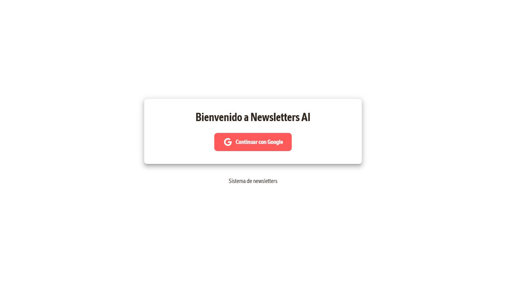

> **Ayuda contextual:** los recorridos pueden cerrarse y volver a iniciarse desde el menú de navegación. No se guarda progreso.

## 2. Inicio y gestión de newsletters

El dashboard centraliza los newsletters y muestra las acciones permitidas para cada fila.

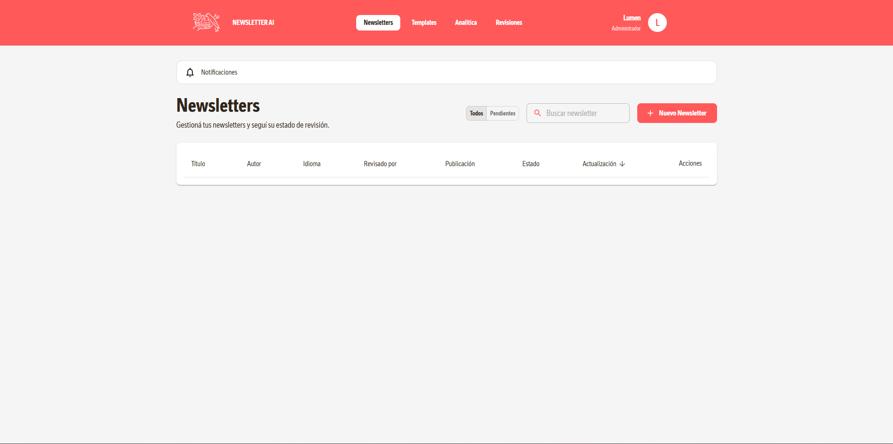

- Usá **Todos** o **Pendientes** para acotar la lista.
- Buscá por título, autor, estado u otra información visible.
- La vista previa permite revisar el contenido sin entrar al editor.
- Editar sólo está disponible para borradores o newsletters con cambios solicitados y según propiedad o rol.
- Eliminar requiere confirmación. La acción no se puede deshacer desde la interfaz.
- Duplicar crea una copia con un título nuevo; crear una nueva edición conserva la trazabilidad del contenido aprobado.

> **Estados:** Borrador y Cambios solicitados permiten edición. En revisión queda bloqueado para el autor. Aprobado habilita exportación para los roles autorizados.

## 3. Crear un newsletter

La creación comienza seleccionando una plantilla publicada y un brandkit. Luego se completa el contexto que recibirá la IA.

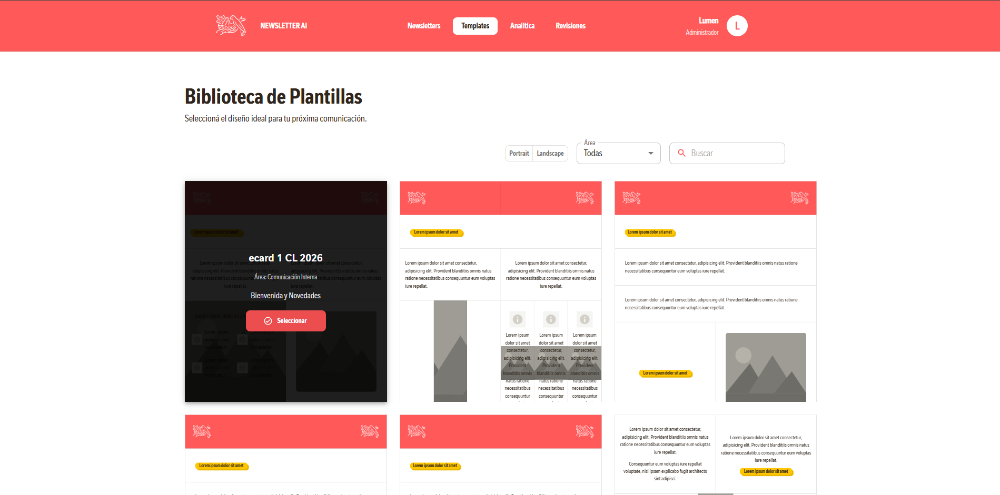

### 3.1 Elegir plantilla y brandkit

- Filtrá la biblioteca por orientación, área o nombre.
- Previsualizá el diseño antes de seleccionarlo.
- Elegí un brandkit activo para aplicar fuentes, colores y recursos autorizados.

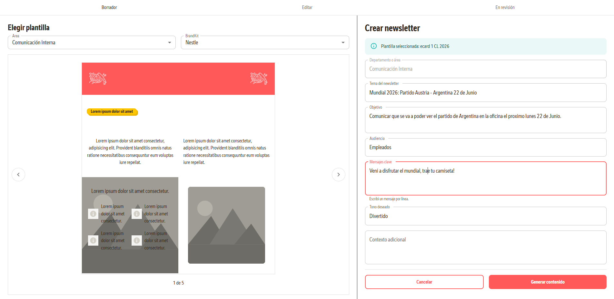

### 3.2 Preparar el pedido para la IA

- Indicá tema, objetivo, audiencia, mensajes clave y tono.
- Agregá fechas, llamada a la acción, contacto y fuentes sólo cuando correspondan.
- Revisá enlaces y datos sensibles antes de generar.
- Si la generación falla, corregí los campos señalados y volvé a intentar. El error no crea envíos automáticos.

## 4. Editar contenido

El editor separa la vista previa del panel de edición. Cada bloque se modifica de forma independiente.

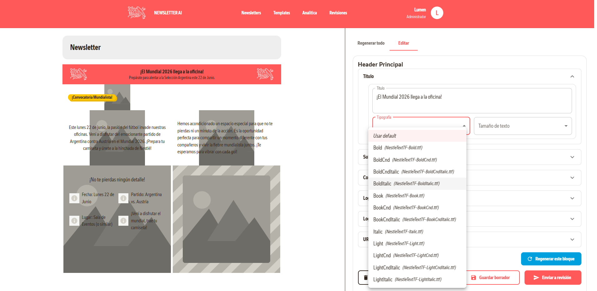

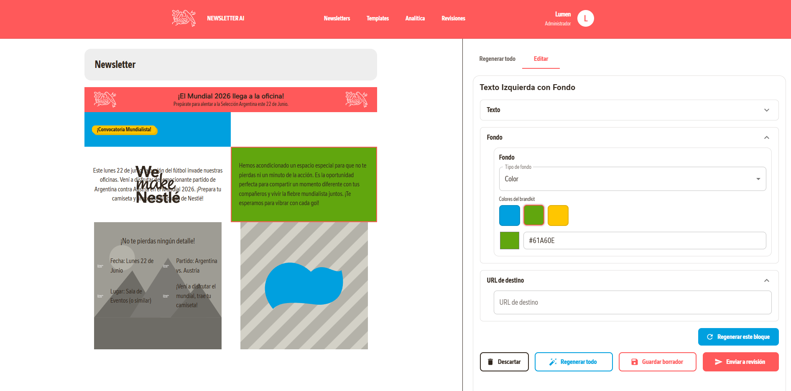

- Seleccioná un bloque directamente en la vista previa.
- Editá los campos disponibles; cada tipo de bloque puede mostrar controles diferentes.
- Elegí imágenes y recursos del brandkit cuando el bloque los admita.
- Usá regeneración de bloque para rehacer sólo una sección o regeneración completa para volver al formulario inicial.
- Guardá como borrador antes de salir. Enviar a revisión cambia el estado y bloquea la edición normal.
- Descartar cambia el estado del newsletter; confirmá que no necesitás continuar trabajando sobre esa versión.

> **Buenas prácticas:** revisá nombres, fechas, enlaces y llamadas a la acción. La salida de IA debe ser validada por una persona antes de la aprobación.

## 5. Revisiones y aprobación

`ADMIN` y `FUNCTIONAL` acceden a la bandeja de revisiones. Cada newsletter puede aprobarse o devolverse con comentarios por bloque.

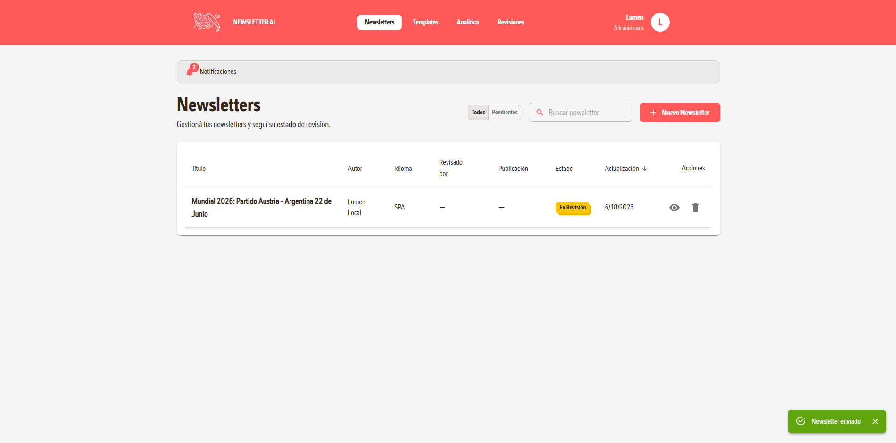

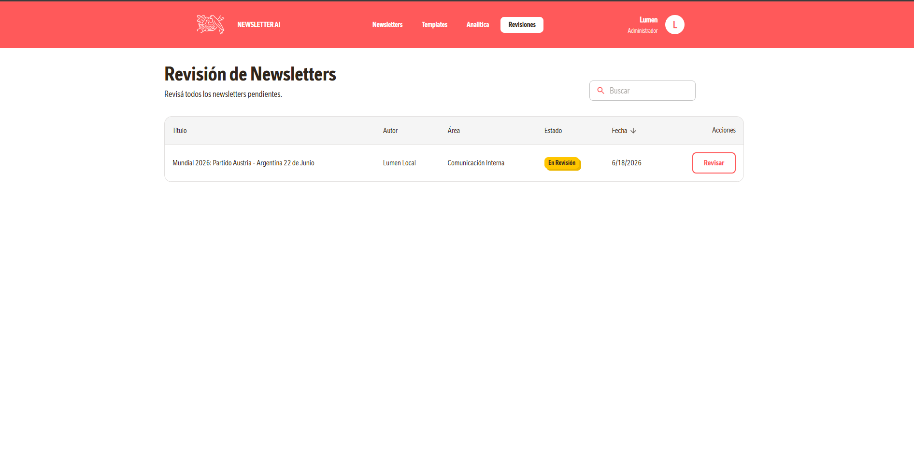

### 5.1 Comentar y decidir

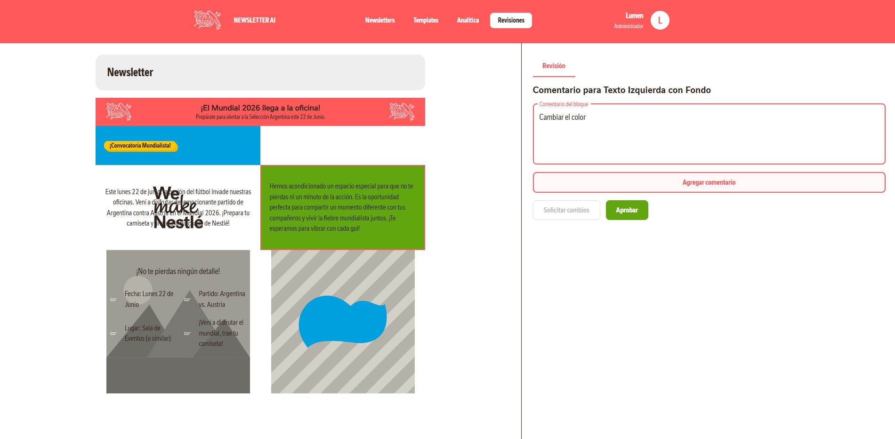

- Abrí una revisión para inspeccionar el newsletter completo.
- Seleccioná el bloque que necesita una observación y agregá el comentario pendiente.
- Para solicitar cambios debe existir al menos un comentario.
- Aprobar confirma que el contenido está listo para exportación.
- Los comentarios y transiciones quedan disponibles en el historial.

### 5.2 Revisar observaciones

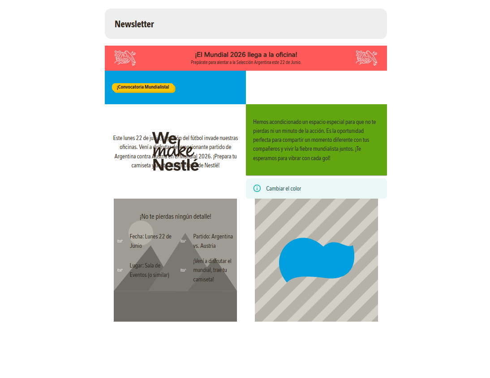

- Revisá cada observación antes de modificar el contenido.
- Seleccioná el bloque relacionado para aplicar el cambio solicitado.
- Guardá las correcciones y reenviá la nueva versión a revisión.

## 6. Duplicar y reutilizar

Una nueva edición permite reutilizar un newsletter existente sin modificar la versión original.

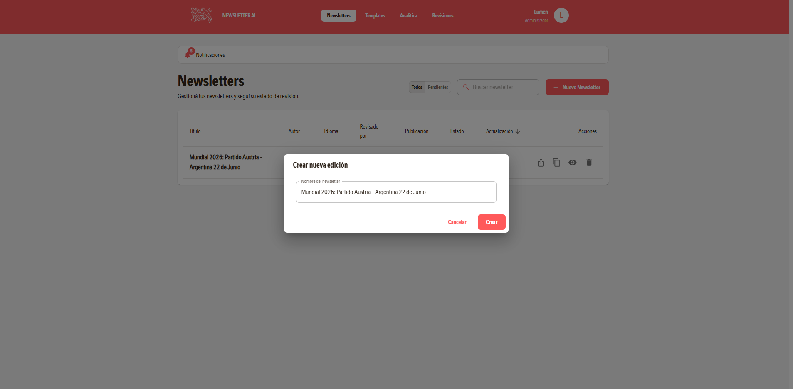

- Duplicar crea un nuevo borrador independiente y solicita un título para identificarlo.
- Usá un nombre que permita diferenciar claramente la nueva edición.
- La copia puede editarse y recorrer nuevamente el circuito de revisión.

### 6.1 Exportar un newsletter

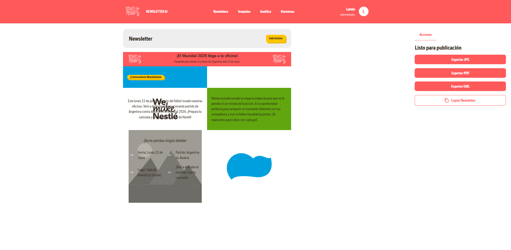

- Revisá la vista final antes de descargar.
- Elegí JPG, PDF o EML cuando la opción esté habilitada para el newsletter.
- Guardá el archivo descargado en una ubicación autorizada.
- La plataforma no envía emails automáticamente.

> **Seguridad:** no compartas exportaciones que contengan información interna fuera de los canales aprobados por la organización.

## 7. Templates

Los templates definen la estructura reutilizable de los newsletters. `ADMIN` puede crear; `ADMIN` y `FUNCTIONAL` pueden revisar y editar según la pantalla.

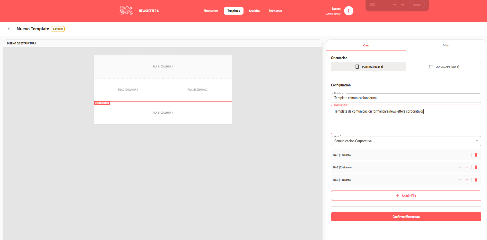

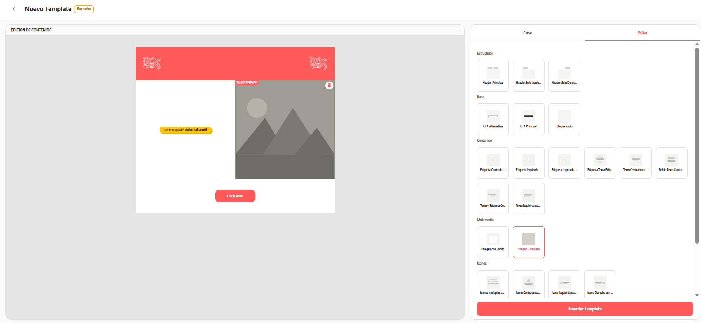

- Desde el listado se puede buscar, previsualizar y abrir la edición.
- Al crear, definí la estructura de filas y columnas antes de asignar tipos de bloque.
- El selector de bloques muestra únicamente definiciones disponibles.
- Usá la vista previa para comprobar jerarquía, orientación y distribución.
- Eliminar un template requiere confirmación y puede afectar su disponibilidad futura, no newsletters ya generados.

## 8. Usuarios y permisos

La administración de usuarios está disponible sólo para `ADMIN`.

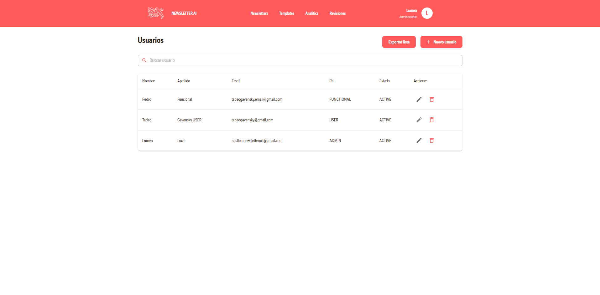

- Buscá por nombre, apellido o email.
- Editar actualiza sus datos y permisos efectivos en próximos accesos.
- Eliminar requiere confirmación; no uses esta acción para resolver un problema temporal de acceso.
- Exportar genera un archivo con el listado visible. Tratá ese archivo como información interna.

### 8.1 Agregar un usuario

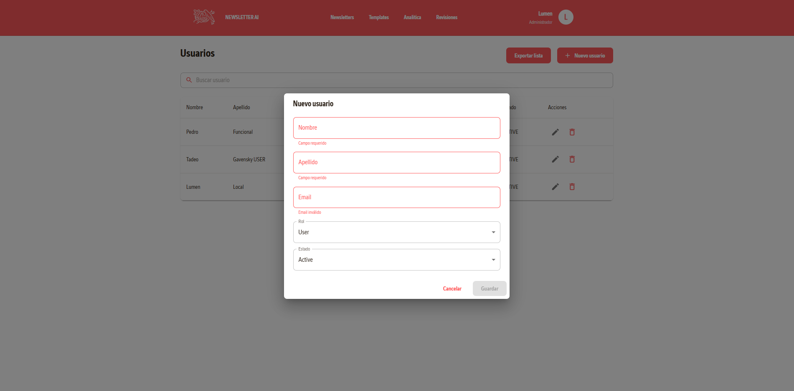

- Completá todos los campos obligatorios con información validada.
- Asigná el menor rol necesario para las tareas de la persona.
- Mantené el estado `ACTIVE` sólo para usuarios que deban acceder a la plataforma.
- Corregí los mensajes de validación antes de guardar.

> **Roles:** no asignes `ADMIN` para resolver una necesidad puntual. Aplicá siempre el menor nivel de acceso necesario.

## 9. Analítica y trazabilidad

La sección de analítica permite consultar actividad, transiciones y comentarios de revisión.

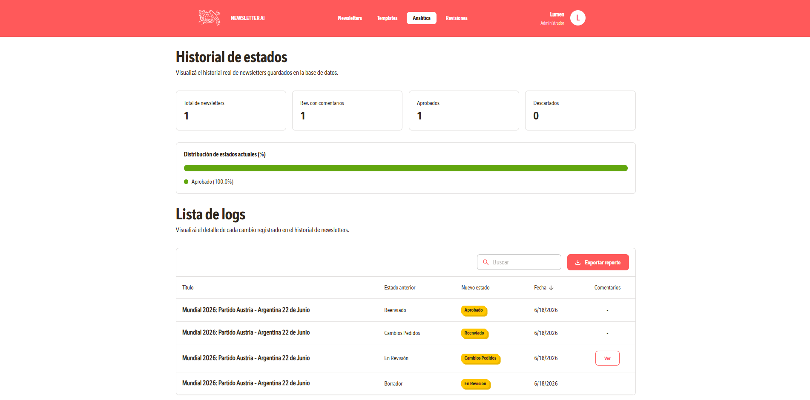

- Usá los indicadores como resumen operativo, no como reemplazo de la revisión de contenido.
- Filtrá el historial y seleccioná un newsletter para ver sus cambios de estado.
- Abrí los comentarios asociados para comprender por qué se solicitó una modificación.
- Las fechas se muestran con la configuración regional de la aplicación.

## 10. Panel administrativo

`ADMIN` administra la configuración global desde las pestañas de IA, materiales y branding.

### 10.1 Configuración de IA

- Administrá los modelos y comandos utilizados por la generación.
- Modificá valores sólo con validación técnica.
- No ingreses credenciales, tokens ni documentos internos en campos de configuración o prompts.

### 10.2 Materiales

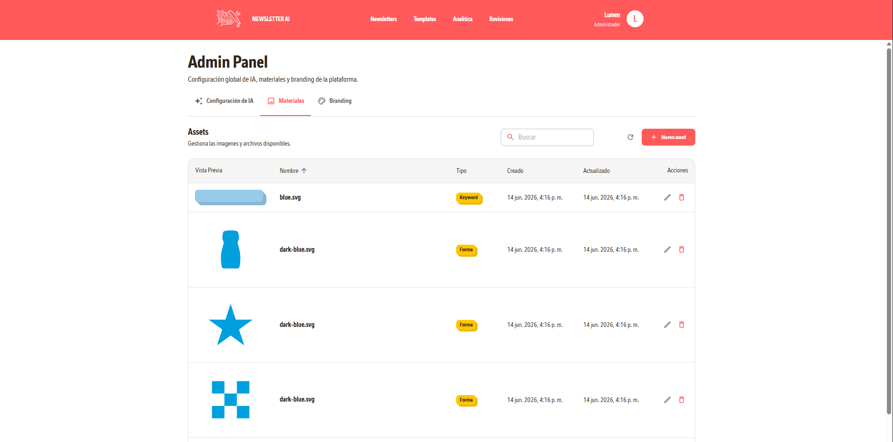

- Creá assets con un nombre y tipo representativos.
- Revisá la vista previa antes de habilitar el recurso para su uso.
- Eliminá únicamente recursos que ya no deban estar disponibles.

### 10.3 Crear un brandkit

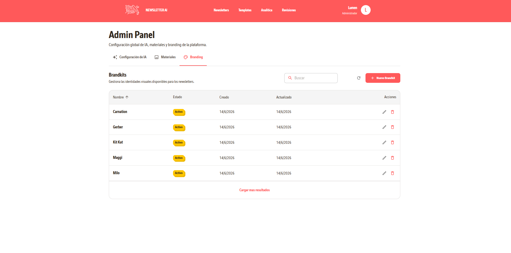

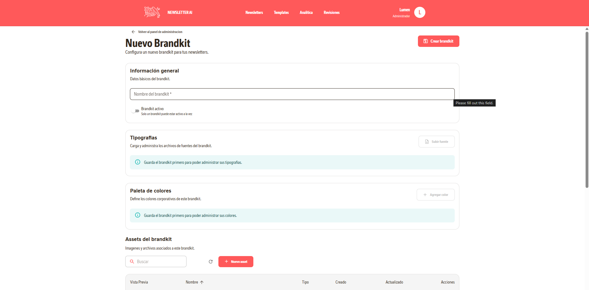

- Definí el nombre y si será el brandkit activo.
- Guardá la información general para habilitar fuentes, colores y assets.
- Sólo un brandkit puede permanecer activo a la vez.

### 10.4 Editar un brandkit

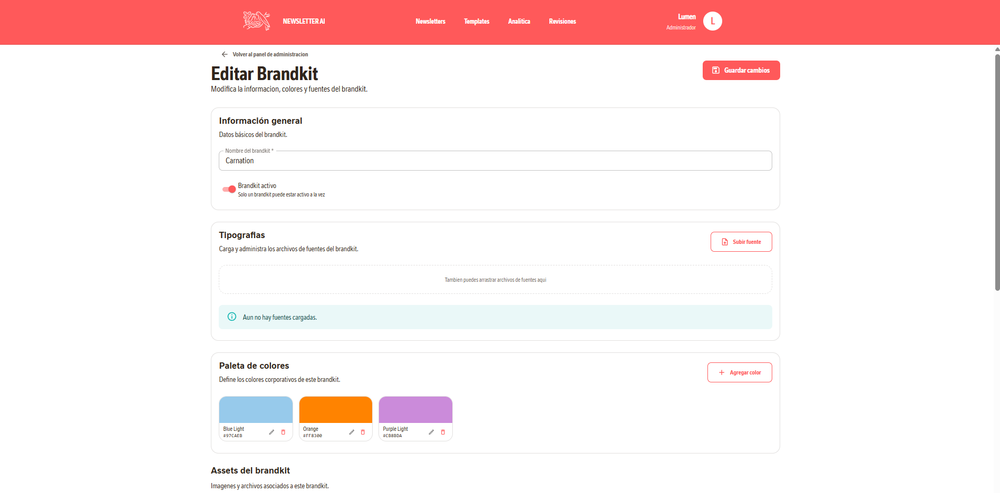

- Subí únicamente archivos de fuentes autorizados.
- Agregá colores corporativos con nombres y valores correctos.
- Administrá los assets asociados y guardá los cambios antes de salir.

## 11. Solución de problemas

Ante un error, conservá el contexto de la operación sin copiar información sensible.

| Situación | Qué hacer |
| --- | --- |
| No aparece una acción | Comprobá el rol, el estado del newsletter y si sos su creador. |
| La sesión expiró | Volvé a iniciar sesión y repetí la navegación. No reenvíes formularios sin revisar sus datos. |
| No carga una lista | Actualizá la página. Si continúa, registrá la sección y la hora aproximada del error. |
| Falló la generación | Revisá los campos y enlaces. Reintentá una vez; si persiste, informá el mensaje visible. |
| No se descarga el PDF o la guía | Permití descargas para el sitio y comprobá que el navegador no haya bloqueado el archivo. |
| El recorrido omite un paso | El control puede no estar disponible en ese estado o para ese rol. El recorrido sólo incluye elementos visibles. |

> **Al pedir soporte:** indicá página, acción, estado y hora aproximada. Nunca adjuntes tokens, cookies, credenciales ni contenido confidencial.
